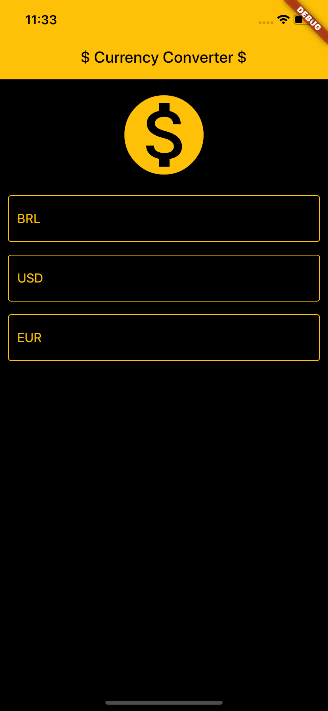
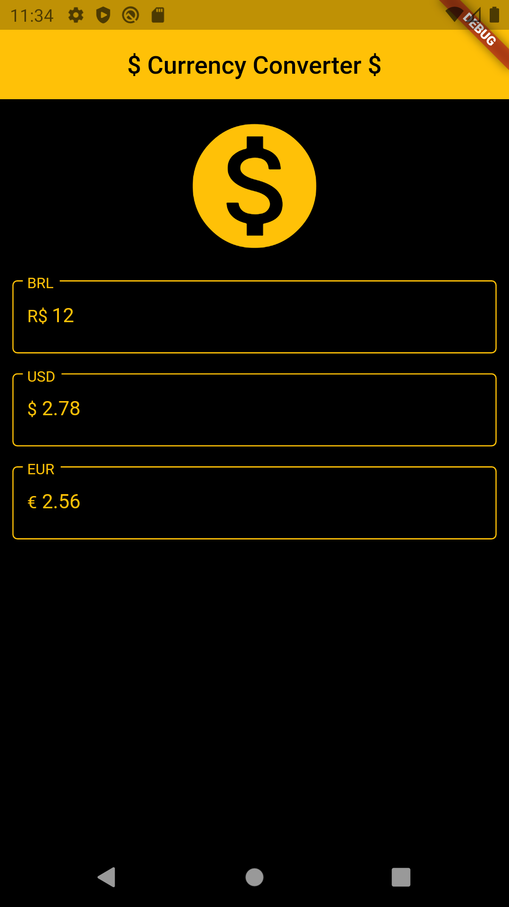

# Currency Converter

A Flutter application to convert currencies in BRL, USD and EUR.

## Getting Started

This project is part of the course ["Criação de Apps Android e iOS com Flutter - Crie 16 Apps"](https://www.udemy.com/course/curso-completo-flutter-app-android-ios/)
published on the Udemy platform.

## Features/Widgets

- TextField
- Icon
- Consuming APIs
- Http
- Future
- FutureBuilder
- AppBar
- Material Design

## Images

### iOS

### Android

