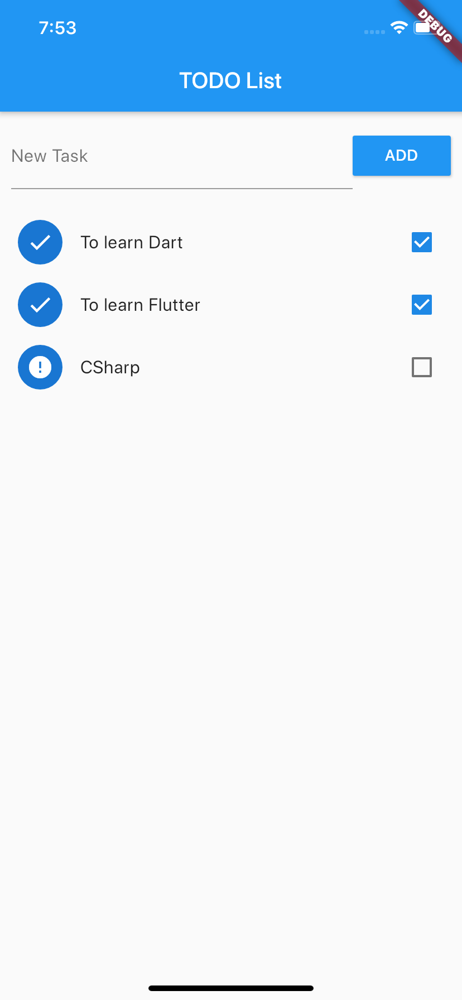
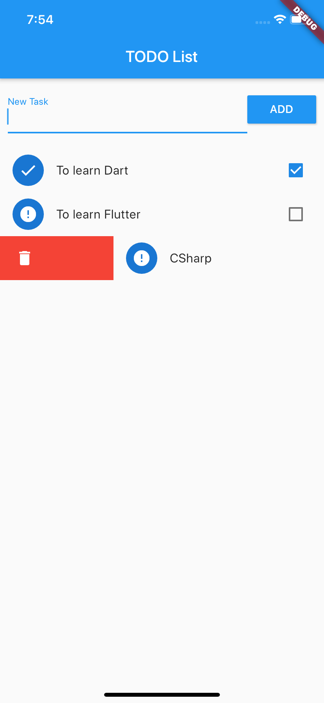
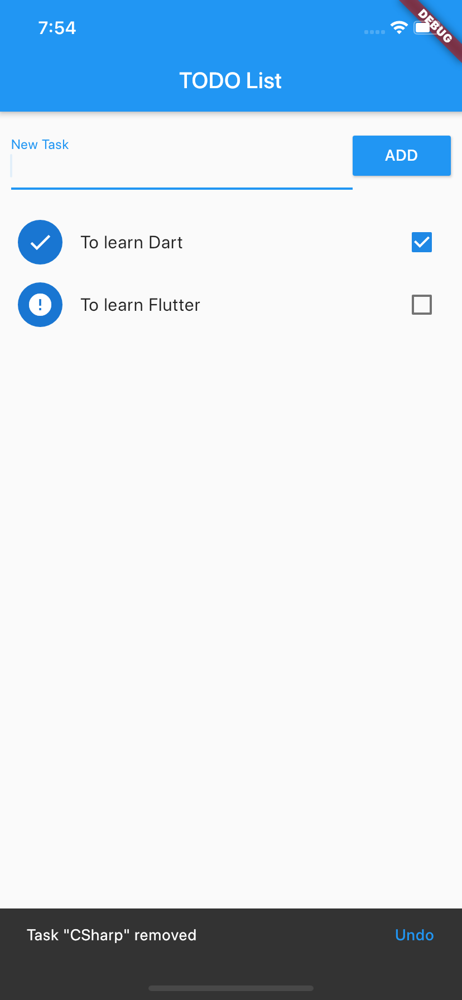

# TODO List

A Flutter application to manage a TODO list.

## Getting Started

This project is part of the course ["Criação de Apps Android e iOS com Flutter - Crie 16 Apps"](https://www.udemy.com/course/curso-completo-flutter-app-android-ios/)
published on the Udemy platform.

## Features/Widgets

- ListView
- SnackBar
- ListStyle
- Circle Avatar
- Checkbox
- Undo
- Refresh Indicator
- Sort Items

## Screenshots

